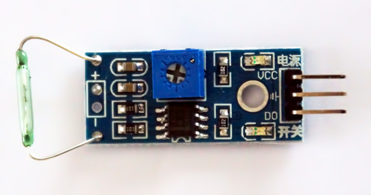

Test module ILS - LM393 pour Arduino
=====================================

Le module  `ILS - Reed Switch LM393` est un interupteur à lames souples. C'est un capteur magnétique qui ouvre ou ferme un contact en fonction d'un champ magnétique.
Le module dispose également d'une puce LM393 qui permet de transformer le capteur analogique d'un simple ILS en capteur digital qui renvoi 0 ou 1.
Par défaut, le capteur renvoi 1 lorsqu'il n'a pas d'aimant à proximité.

Caractéristiques du module :

    Pin 1 : Sortie digital (0/1)  
    Pin 2 : GND  
    Pin 3 : VCC  
    Comparateur LM393  
    Tension de 3 à 5V  
    Ampérage au moins 15mA  

L'article expliquant le fonctionnement test se trouve sur <http://www.konectik.com/2017/02/16/test-capteur-dht22-arduino-uno/>